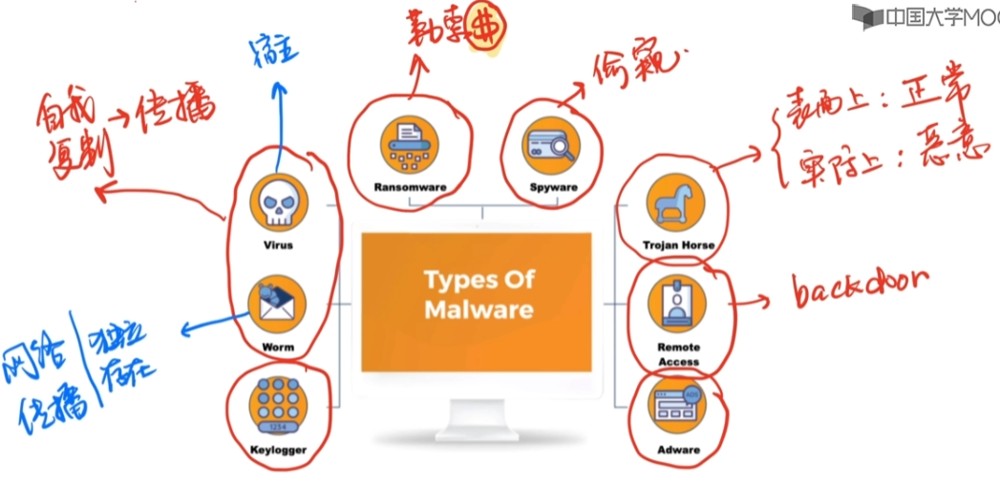

# 第一章 恶意软件导论

[toc]

1. 恶意软件定义
2. 恶意软件发展史
3. 恶意软件分类
4. 恶意代码模型

---

## 1.1 恶意软件定义

1. 字典里的 Malware？
   
   - a computer program designed specifically to damage or disrupt a system, such as a virus.
   - 是一种专门设计出来用于破坏、扰乱系统的计算机程序，如：病毒。`test`

2. 2016年11月22日，中国互联网协会公布了“恶意软件”定义：“==在未明确提示用户或未经用户许可的情况下，在用户计算机或其他终端上安装运行，侵害用户合法权益的软件，但不包含我国法律法规规定的计算机病毒。==”
   
   - 强制安装
   
   - 难以卸载
   
   - 浏览器劫持
   
   - 广告弹出
   
   - 恶意收集用户信息
   
   - 恶意卸载
   
   - 恶意捆绑
   
   - 其他侵害用户软件安装、使用和卸载知情权、选择权的恶意行为
     
     [2021年中国网络安全报告](2021年中国网络安全报告 - 瑞星.pdf) 

## 1.2 恶意软件发展史

## 1.3 恶意软件分类

## 1.4 恶意代码模型

## 1.5 恶意代码分析技术

---

# 第二章 静态分析基础技术

## 2.1 从小白开始

### 2.1.1 可执行文件

1. **什么是可执行文件**

- 所有操作系统只识别两种文件类型
  - 文本文件
  - 可执行文件

2. **ELF格式**

- 可执行与可链接格式（Executable and Linkable Format，缩写ELF），是一种用于可执行文件、目标代码、共享库和核心转储（core dump）的标准文件格式。
- 扩展名：`无扩展名`、.`o`、.`so`、`.elf`、`.prx`、`.axf`、`.bin`、`.puff`、`.ko`、`.mod`
- 特征签名（Signature）：`0x7f 45 4c 46`→`0x7f  ‘E’  ‘L’ ‘F’`
- 支持的系统
  - Unix-like：Linux、Solaris/lllumos、IRIX、FreeBSD、NetBSD、OpenBSD、Redox、DragonFly BSD、Syllable、HP-UX、QNX Neutrino、MINIX
  - Non-Unix：OpenVMS、BeOS、Haiku、Stratus VOS、SkyOS、***FUchsia OS***(by Google in 2016)、Z/TP、HPENonStop OS、Deos、***Windows Subsystem for Linux compatibility system***
  - Game console：PS、Nintendo 64、Wii、Wii U
  - Mobile phones：Symbian、Android

3. **PE格式**

- 可移植性可执行文件（Portable Executable，缩写为PE）是一种用于可执行
